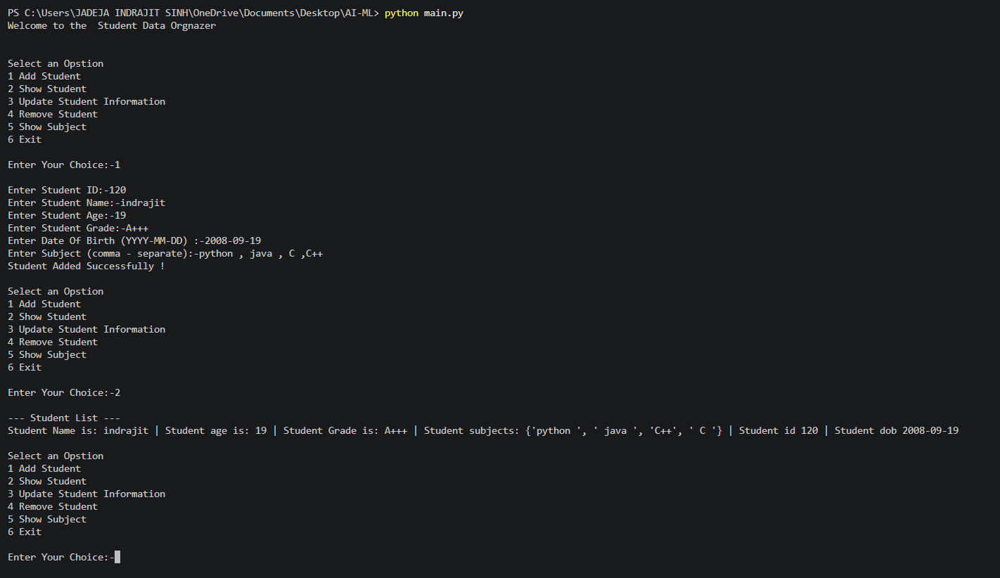

# 🎓 Student Data Organizer

A simple **Python console-based Student Data Organizer** project that allows users to add, view, update, remove, and manage student information.

## 📌 Project Description

The **Student Data Organizer** is a beginner-friendly Python project created to practice basic Python programming concepts and data structures.

The program provides a menu-driven interface where users can manage student information during runtime.

## 📸 Project Output

The project output screenshot is available in:





## 🚀 Features

The project provides the following options:

1. **Add Student**
2. **Show Student**
3. **Update Student Information**
4. **Remove Student**
5. **Show Subject**
6. **Exit**

## 👨‍🎓 Student Information

For every student, the program stores:

* Student ID
* Student Name
* Student Age
* Student Grade
* Date of Birth
* Subjects

## 🗂️ Data Structures Used

This project uses different Python data structures.

### List

The `students` list stores all student records.

```python
students = []
```

### Dictionary

Each student's information is stored inside a dictionary.

```python
student = {
    "name": name,
    "Age": age,
    "grade": grade,
    "subject": subject,
    "info": id_dob
}
```

### Set

Subjects are stored using a set to avoid duplicate subjects.

```python
s = set(subject.split(","))
```

### Tuple

Student ID and Date of Birth are stored together in a tuple.

```python
id_dob = (id, dob)
```

## 📋 Menu

When the program starts, the following menu is displayed:

```text
Select an Option

1 Add Student
2 Show Student
3 Update Student Information
4 Remove Student
5 Show Subject
6 Exit
```

## ➕ Add Student

The user can add a new student by entering:

* Student ID
* Student Name
* Student Age
* Student Grade
* Date of Birth
* Subjects

### Example

```text
Enter Student ID:-101
Enter Student Name:-Rahul
Enter Student Age:-20
Enter Student Grade:-A
Enter Date Of Birth (YYYY-MM-DD) :-2006-05-15
Enter Subject (comma-separate):-Python,Java,SQL
```

## 👀 Show Student

This option displays the stored student information.

The program shows:

* Student Name
* Student Age
* Student Grade
* Student Subjects
* Student ID
* Date of Birth

## ✏️ Update Student Information

The user can search for a student using the **Student ID** and update the following information:

1. Name
2. Age
3. Subjects
4. Grade
5. Stop Update

## ❌ Remove Student

The user can enter a **Student ID** to remove a student from the student list.

Example:

```text
Enter Student ID:-101
Student Removed Successfully
```

## 📚 Show Subject

The user can enter a Student ID to view the subjects associated with that student.

## 🚪 Exit

Option `6` exits the program.

```text
Thank You For Using Student Data Organizer Project!
```

## 🛠️ Technologies Used

* **Python 3** – Programming language used to build the project
* **VS Code** – Code editor used for development
* **Git** – Version control
* **GitHub** – Repository hosting and project management

## 📁 Project Structure

```text

│
├── main.py
├── output.png
└── README.md
```

### 📄 File Description

* **main.py** – Main Python program containing the Student Data Organizer code.
* **output.png** – Project output/screenshot.
* **README.md** – Project documentation and information.

## ▶️ How to Run

### 1. Install Python 3

Make sure Python 3 is installed on your computer.

Check the Python version:

```bash
python --version
```

### 2. Open the Project

Open the project folder in **VS Code**.

### 3. Run the Program

Open the terminal and run:

```bash
python main.py
```

## 🎯 Learning Objectives

This project helps in understanding and practicing:

* Python basics
* Variables
* User input
* `if-elif-else` statements
* `for` loops
* `while` loops
* Lists
* Dictionaries
* Sets
* Tuples
* CRUD operations
* Menu-driven programs


## 👨‍💻 Author

INDRAJIT
